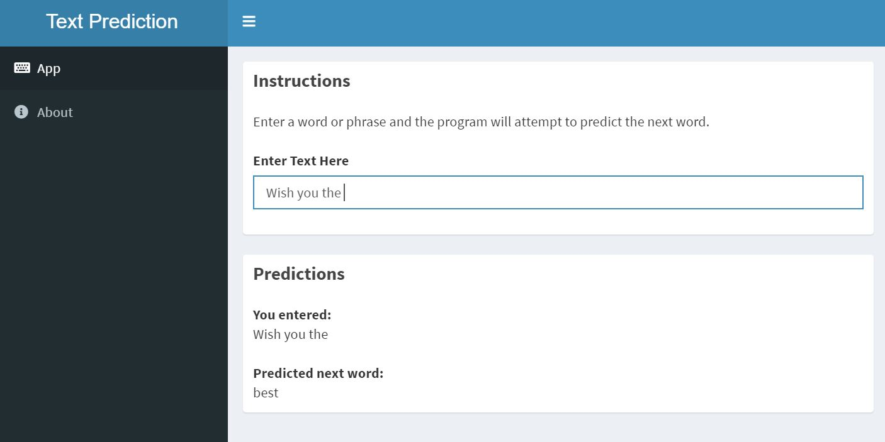

## Introduction

* Text prediction is one useful application of natural language processing where it finds uses in smartphones and text processing programs.

* The aim of this project is to develop an application which would predict the next word in a phrase that a user inputs in.

* For this project, the prediction model was built from data taken from news articles, blog posts and twitter feeds from the internet. 

---
## App Outline

---
## App Description

* The **App** tab holds the prediction app which is designed to be simple and intuitive to use. 

* The user would simply need to key in the words for prediction and the app would provide the predicted words in real time in the lower box. 

* A one-liner instruction is also provided to ensure smooth user experience. 

* The **About** tab contains information about the project and the developer.

---
## Algorithm

* The raw data was first cleaned to remove punctuations, delimiters and other non-text elements. Following which, a sample of the data was extracted out to build a ngram database. Steps on how the data was cleaned can be found at the following [link](https://github.com/dillonchewwx/coursera-jhudatasciencecapstone/blob/main/LoadandCleanData.R).

* For prediction, the algorithm first considers the number of words entered. If the number of words are equal or more than 3, the quadrigram database is used. Here, the last 3 words would be used for matching with the quadrigram database. If no match is found, the last 2 words would then be used for matching with the trigram database. Lastly, if there is still no match, the last word would then be used for matching using the bigram database.

* If the number of words are 1 or 2, then the bigram and trigram database would be used respectively. 
